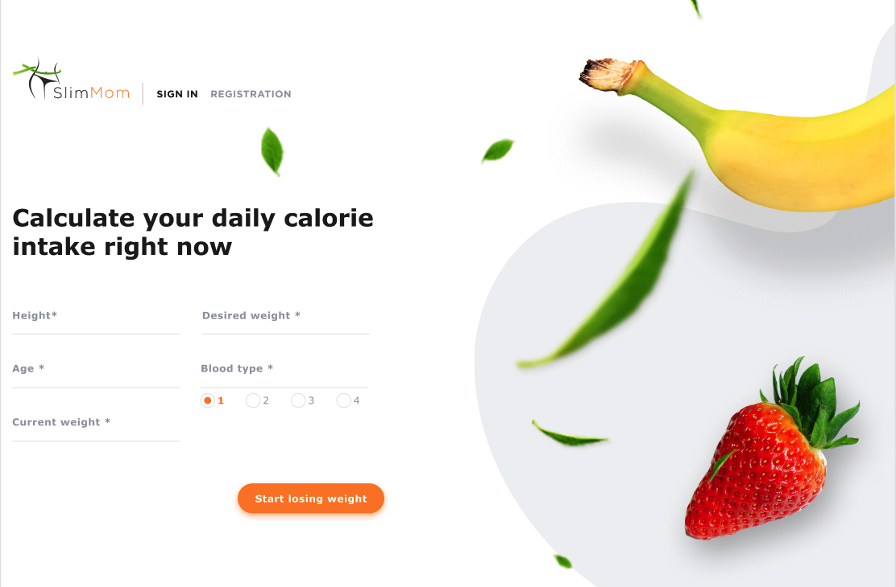

Final Front-end project

# Team project "SlimMom"

completed after finished the React Module course Full Stack Developer Bootcamp
23 Online by GoIt

##

[Figma](https://www.figma.com/file/pYNgcQWC5EQHcQQs4wHA56/HEALTH-EN?node-id=0%3A1)



[Task List](https://docs.google.com/spreadsheets/d/1akFlYhwUxWxjSY3XQbgZfA9CFwpCpq_wApaO5d-j3lM/edit#gid=0):

```
1. Layout mobile, tablet, desktop
2. Write a reducer for the loader
3. Layout mobile, tablet, desktop
4. When clicking outside the modal, close it, remove event listeners when closing the modal
5. Close the modal by pressing "Escape"
6. Mobile layout, tablet, desktop. It is on all pages. Import and substitute its components: Logo, UserInfo, Navigation
7. Implement rendering according to the conditions of the UserInfo, Navigation components
8. Layout mobile, tablet, desktop
9. When pressed, the user will enter DiaryPage on the page
10. Layout mobile phone, tablet, desktop
11. Display only when the user is registered
12. Implement the output of information about the user component
13. When clicking on the exit button, write an action and an operation for the user to exit
14. Layout mobile, tablet, desktop
15. Implement page navigation
16. Mobile layout, tablet, desktop. Responsible for positioning elements and components on the page. Import and substitute its DailyCaloriesForm component. Public page
17. Layout mobile phone, tablet, desktop
18. Validate form fields
19. When clicking on the "Lose weight" button, you need to collect data from the form, highlight it and open the Modal components (modal window) with the DailyCalorieIntake component inside
20. Layout mobile phone, tablet, desktop
21. Implement dynamic data output
22. Mobile layout, tablet, desktop. Responsible for positioning elements and components on the page. Import into yourself and substitute its LoginForm component. Public page
23. Layout mobile phone, tablet, desktop
24. Validate form fields
25. Write an action and a login operation
26. When clicking on the "Registration" button, the user goes to the RegistrationPage
27. Layout mobile phone, tablet, desktop. Responsible for positioning elements and components on the page. Import and substitute its RegistrationForm component. Public page
28. Layout mobile phone, tablet, desktop
29. Validate form fields
30. Write an action and operation for registration
31. When clicking on the "Login" button, the user goes to the LoginPage
32. Layout mobile phone, tablet, desktop
33. Implement dynamic data substitution
34. Layout mobile phone, tablet, desktop. Responsible for positioning elements and components on the page. Import this component and its subcomponents: DiaryDateСalendar, DiaryAddProductForm, and DiaryProductsList. Private page
35. Layout mobile phone, tablet, desktop. Connect the calendar library
36. Mobile layout, tablet, desktop
37. Write an action and operation for adding a new product
38. Layout mobile phone, tablet, desktop. Import this component its subcomponent DiaryProductsListItem
39. Display the list according to the date indicated in the calendar above
40. Layout mobile phone, tablet, desktop
41. Implement a dynamic substitution of the data that it will accept
42. When clicking on the cross button, write an action and an operation to remove this product
43. Layout mobile phone, tablet, desktop. Responsible for positioning elements and components on the page. Import into this component its subcomponent CalculatorСalorieForm. Private page
44. Mobile layout, tablet, desktop
45. Validate form fields
```

Technologies used to implement the project:

- vs code
- git
- npm
- parcel
- HTML 5
- SASS
- CSS grid
- JS
- React
- Redux Persist
- React Spinners
- PropTypes
- Node.js

## Development team:

[Denys Dashkevych](https://github.com/MajorPrestige) (Team-Lead)

- logo
- registration form
- calculatorCalorieForm
- calculatorPage

[Sergii Gulaga](https://github.com/Ry6ens) (Scrum Master)

- dairyPage
- diaryDateCalendar
- dairyForm
- dairyProductListItem
- dairyProductList
- dairyAddProductForm

[Katherine Dudar](https://github.com/Katherineeeeeeee) (Full Stack Dev)

- loader (spinner)
- 404 page not found
- main page
- loging page
- registration page
- loginForm
- registration form

[Andrii Klochko](https://github.com/oLORDer) (Full Stack Dev)

- header
- navigation
- userinfo
- main page
- dailyCalorieIntake
- registration page
- login page
- rightSideBar

[Yuriy Dovzhyk](https://github.com/YDovzhyk) (Full Stack Dev)

- modal
- dailyCaloriesForm
- errorMessage

[Maksym Perlovskyi](https://github.com/Maksym150678) (Full Stack Dev)

- rightSideBar
